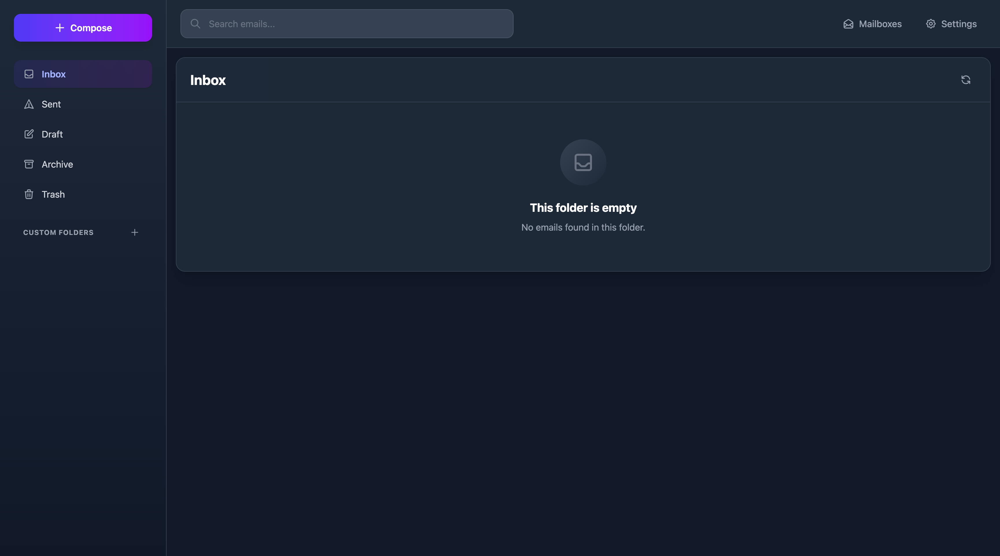

# ses-mail-worker

Self-hosted webmail for your own domain that runs on the **Cloudflare Workers Free plan**. Cloudflare Email Routing receives mail, **Amazon SES** sends it, and a static Vue dashboard reads it.

Built on [Email Explorer](https://github.com/G4brym/email-explorer) by Gabriel Massadas (MIT). This project adds sending through Amazon SES, a deployment config, and the notes below.

<p align="center"></p>

## How it works

```
sender  ──> Cloudflare Email Routing ──> Worker email() ──> Durable Object per mailbox + R2 attachments
browser ──> static dashboard (no Worker CPU) ──> /api/* on the Worker ──> Durable Object
compose ──> /api/* ──> Worker ──> Amazon SES API v2 ──> recipient
```

- **Receiving:** Email Routing hands each message to the Worker, which parses it and stores it in that address's Durable Object (SQLite). Attachments go to R2. A mailbox appears the first time mail arrives for an address.
- **Reading:** the Vue dashboard is served as static files. Only `/api/*` requests run Worker code, a small Hono API.
- **Sending:** the Worker signs a request to the SES API. SES builds the message, DKIM-signs it for your domain and delivers it to every recipient. The sent copy is stored under the Message-ID SES assigns, so replies land in the same conversation.

## Why it fits the free plan

The Workers Free plan allows 10 ms of CPU per request, and Cloudflare's own Email Sending needs the Workers Paid plan to reach arbitrary recipients. This project exists because a server-rendered Next.js mail app on the same plan averaged about 13.5 ms of CPU per request and had roughly one request in twenty killed with Error 1102. Here the browser renders the interface, the Worker only answers small API calls and processes incoming mail, and SES does the sending.

| Piece | Service | Cost |
|---|---|---|
| Receiving | Cloudflare Email Routing | free |
| App | Cloudflare Workers Free | 100,000 requests/day, 10 ms CPU per request |
| Storage | Durable Objects (SQLite) + R2 | R2 free up to 10 GB |
| Sending | Amazon SES | $0.10 per 1,000 emails |

## Features

- Inbox, folders, contacts, search and attachments
- Rich text composer; reply, reply all and forward
- Multiple users: the first to register becomes admin and registration closes; admins create users and grant mailbox access (owner, admin, write, read)
- Sessions in HttpOnly cookies, valid for 30 days

## Setup

You need a domain on Cloudflare with Email Routing enabled, an AWS account, and Node.js 20.19+ on Linux, macOS or WSL (the build uses `cp -R`).

### 1. Amazon SES

1. In the SES console, create a **domain identity** for your domain with Easy DKIM. Optionally give it a custom MAIL FROM subdomain such as `bounce.example.com`.
2. Add the records SES lists to your Cloudflare DNS: three DKIM `CNAME` records set to DNS only, plus an `MX` and a `TXT` record for a custom MAIL FROM domain. A `_dmarc` `TXT` record such as `v=DMARC1; p=none;` is recommended.
3. Create access keys allowed `ses:SendEmail` on that identity.
4. Request production access. Until it is granted, SES only delivers to addresses verified in SES, at most 200 a day.

### 2. Deploy

```bash
git clone https://github.com/dharunashokkumar/ses-mail-worker.git
cd ses-mail-worker
npx wrangler login
npx wrangler r2 bucket create email-explorer
bash deploy/deploy.sh    # install, build, test, deploy
```

To rename the Worker or the bucket, edit `deploy/wrangler.jsonc` first.

### 3. Worker secrets

Run these from `deploy/` so Wrangler targets the right Worker:

```bash
printf ses | npx wrangler secret put EMAIL_PROVIDER
printf us-east-1 | npx wrangler secret put AWS_SES_REGION   # the Region of your SES identity
npx wrangler secret put AWS_ACCESS_KEY_ID
npx wrangler secret put AWS_SECRET_ACCESS_KEY
```

Optional: `AWS_SES_CONFIGURATION_SET`, and `AWS_SES_MESSAGE_ID_DOMAIN` (defaults to `<region>.amazonses.com`, or `email.amazonses.com` in us-east-1).

### 4. Route mail to the Worker

In the Cloudflare dashboard, open your domain's **Email Routing** and add a routing rule for each address you want, for example `me@example.com`, with the action *Send to a Worker* and your Worker selected. Keep the catch-all disabled: every address that reaches the Worker gets its own mailbox.

### 5. First login

Open the Worker's URL and register. The first account becomes admin and registration closes. Your mailbox appears when the first email to its address arrives.

## Development

```bash
pnpm install
pnpm lint
pnpm build
cd packages/worker && pnpm test
```

Architecture notes for contributors are in [CLAUDE.md](CLAUDE.md), and user guides in [docs/features](docs/features/index.md).

## Known limitations

- One mailbox per user account; admins can grant access to more.
- Passwords are stored as a single SHA-256 digest rather than a slow password hash, so use a unique password.
- Received emails are stored under random IDs, so the `In-Reply-To` of a reply you send doesn't name the original Message-ID and some mail clients won't thread it. Gmail still groups by subject.
- Password recovery by email (`accountRecovery.fromEmail`) is off in `deploy/index.ts`.
- Without `EMAIL_PROVIDER=ses`, sending falls back to Cloudflare's `send_email` binding, which reaches only the first recipient and needs Cloudflare Email Sending.

## Credits and license

Built on [Email Explorer](https://github.com/G4brym/email-explorer) by Gabriel Massadas. MIT licensed; see [LICENSE](LICENSE).
